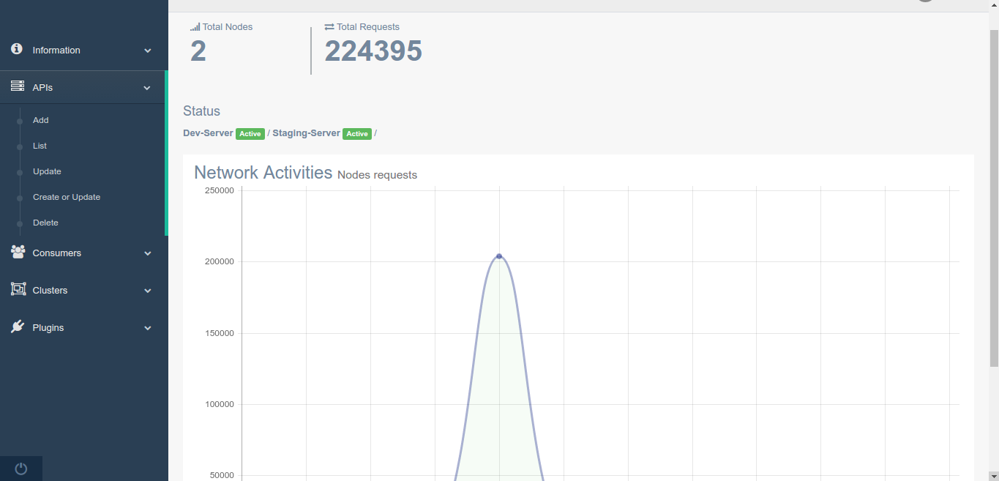

# dashy
Simple Stupid Kong Admin Dashboard i made for my homie over the weekend, now making it available for all other homies.

__WIP__

## Features.

- [x] Node Status and Network Requests Overview
- [x] Admin User
- [x] Retrieve Node Information
- [x] Retrieve Node Status
- [x] Add Node To Track
- [x] Add APIs
- [x] List APIs
- [x] Update APIs
- [x] Update or Create APIs
- [x] Delete APIs
- [x] Add Consumers
- [x] List Consumers
- [x] Update Consumers
- [x] Update or Create Consumers
- [x] Delete Consumers
- [x] Retrieve Cluster Status
- [ ] Forcibly Remove a Node
- [x] Add Plugins
- [x] List All Plugins
- [x] List Plugins per API
- [ ] Update Plugins
- [ ] Update or Create Plugins
- [ ] Delete Plugins
- [ ] Retrieve Enabled Plugins
- [ ] Retrieve Plugin Schema

## Setup

Requires:

1. node `4.3.0 or higher`.
2. Mongodb

`git clone` or `npm i`

Edit `config/index.js` where appropriate esp the admin username and password.

## More

Built with [Gentelella Boostrap Admin Dashboard](https://github.com/puikinsh/gentelella.git).

## LICENSE

MIT
